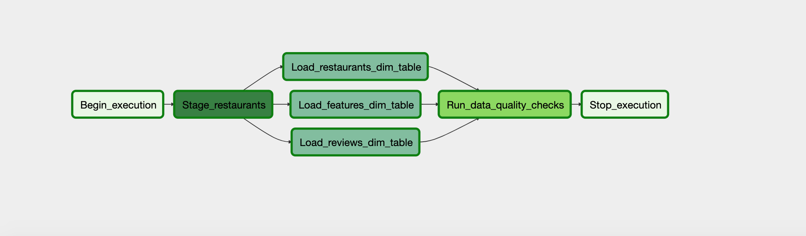

# Tripadvisor Restaurants Data Warehouse

The objective of this project is to develop a robust data warehouse to store Tripadvisor's restaurants and reviews so smooth aggregation can be performed based on city and reviews of the restaurants. Dataset used in this project is scraped from https://www.tripadvisor.com/. This project is part of Udacity's Nano Degree program in which all the techniques learned during the degree are utilized.

### Scope of the Project

This project provides a good start to aggregate restaurants based on location, ratings and features.  There are some common questions that can be answered using this data warehouse:

- Aggregate all the New York restaurants with rating more than 3.9
- Aggregate all the restaurants that offer private dining
- Any restaurant that do not offer asian cuisine.
  
### Tools and Technologies
  
We are using Apache Airflow to manage our data pipelines. We used [Amazon S3](https://aws.amazon.com/s3/) to store our CSV dataset and [Amazon Redshift](https://aws.amazon.com/redshift/) to build our primary data warehouse.

#### Why using these technologies?

- There are plenty of options we can use to store our dataset but I used [Amazon S3](https://aws.amazon.com/s3/) because its scalability, data availability, security, and performance all in one place. Also it is very convenient to use S3 and redshift together.

- For data workflow I used Apache Airflow because of its countless features like scheduling, web UI, huge number of already build plugins and operators. With the web UI It makes data ingestion pretty easier and debugging less painful.

- Building a data warehouse can be overwhelming while choosing the right technologies. We have multiple options available from different big tech companies like Google BigQuery, Redshift and Snowflake etc. I used Redshift because of the its performance and compatibility with S3.

  
### Data Modeling and Data Dictionary

This warehouse consists of 3 dimensional tables and one staging table. Schemas are given below:
  

#### Staging table

##### TABLE staging_restaurants

~~~

|-- resturant_id: int4,

|-- name: varchar(256),

|-- city: varchar(256),

|-- state: varchar(256),

|-- postal_code: varchar(256),

|-- address: varchar(512),

|-- cuisines: varchar(256),

|-- seating: bool,

|-- delivery: bool,

|-- takeout: bool,

|-- private_dining: bool,

|-- reservations: bool,

|-- review_score: float4,

|-- number_of_reviews: int4,

|-- url: varchar(2048)

~~~

  

#### Dimension tables

  

##### TABLE restaurants

  

~~~~

|-- resturant_id: int4,

|-- name: varchar(256),

|-- city: varchar(256),

|-- state: varchar(256),

|-- postal_code: varchar(256),

|-- address: varchar(512),

|-- url: varchar(2048)

~~~~

  

##### TABLE reviews

  

~~~~

root

|-- id: INT IDENTITY(1,1) PRIMARY KEY

|-- review_score: float4,

|-- number_of_reviews: int4,

|-- resturant_id: int4

~~~~

  

##### TABLE features

  

~~~~

root

|-- id: INT IDENTITY(1,1) PRIMARY KEY

|-- cuisines: varchar(256),

|-- seating: bool,

|-- delivery: bool,

|-- takeout: bool,

|-- private_dining: bool,

|-- reservations: bool,

|-- resturant_id: int4

~~~~

  

--------------------------------------------

### How to run the project?

- Install and configure Apache Airflow

- Upload data to S3. Make sure to have s3 bucket and Redshift cluster in the same region.

- Now spin up [Amazon Redshift](https://aws.amazon.com/redshift/) cluster with desired configurations. I used a `dc2.large`  with 4 nodes

- Access Airflow web UI on  localhost:8080 add a connection named `redshift`  for redshift cluster and another connection `aws_credentials` that has access to S3 and Redshift.

- Replace the S3 dataset URI in the code file `restaurants_dag.py`

- Now the final step is to run DAG on Web UI, go to DAGs > restaurants_dag and run the DAG.

  

### Outputs

The successful run of DAG looks like the following:

#### DAG Graph View

### Scenarios

- #### If the data was increased by 100x.

- Spark would be the perfect candidate for this scenario due to its distributed architecture. AWS provides multiple options for example running self managed Spark instance on EC2 or fully managed EMR cluster without worrying about the Ops overhead.

- EMR storage layer includes the different file systems like HDFS, EMRFS etc. S3 can also be used as staging area.

- #### If the pipelines were run on a daily basis by 7am.

- This can easily be achieved by using Apache Airflow and setting a daily interval to 7 AM. We can also provide a crontab syntax of `0 7 * * *` in the `schedule_interval` argument of the `DAG`

- #### If the database needed to be accessed by 100+ people

- Redshift would be the right candidate to achieve this. With the Concurrency Scaling feature, it can support virtually unlimited concurrent users and concurrent queries, with consistently fast query performance.
